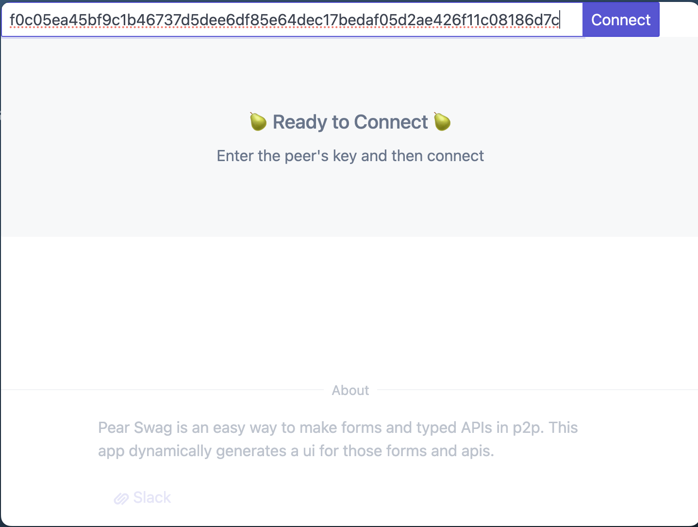
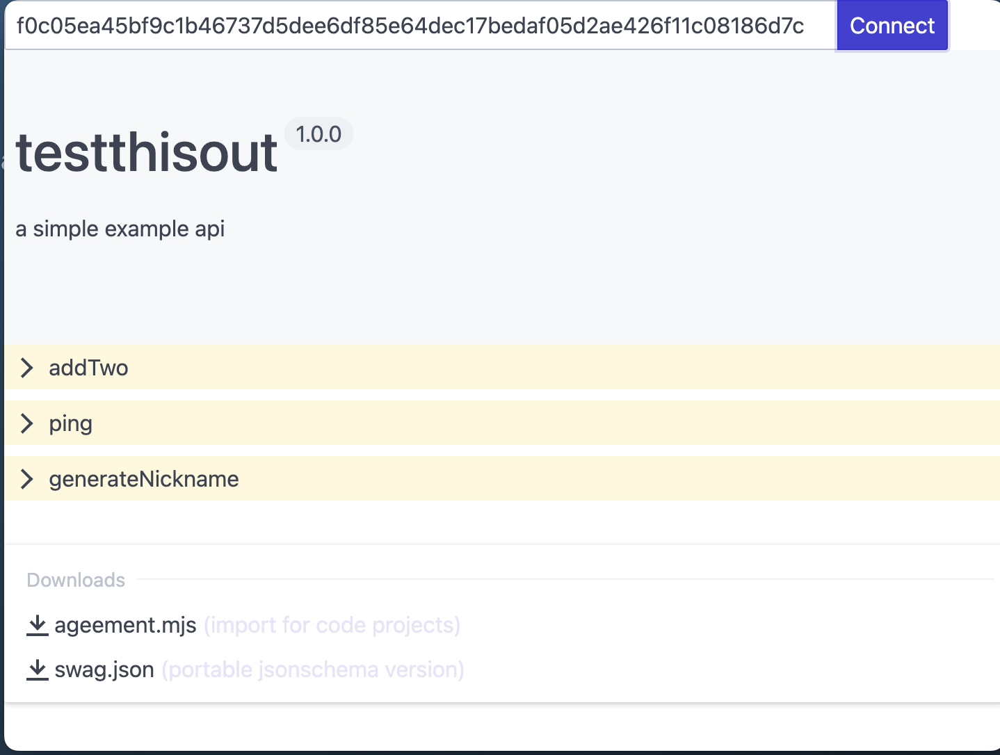
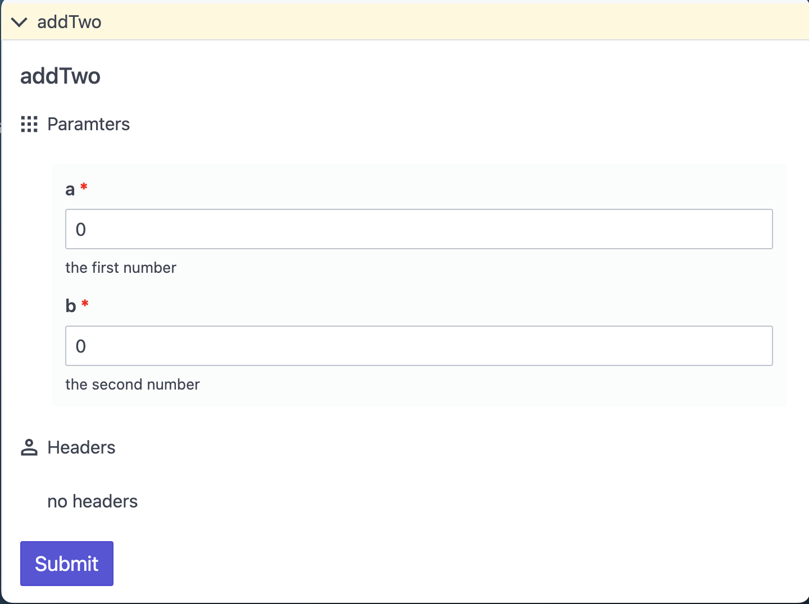
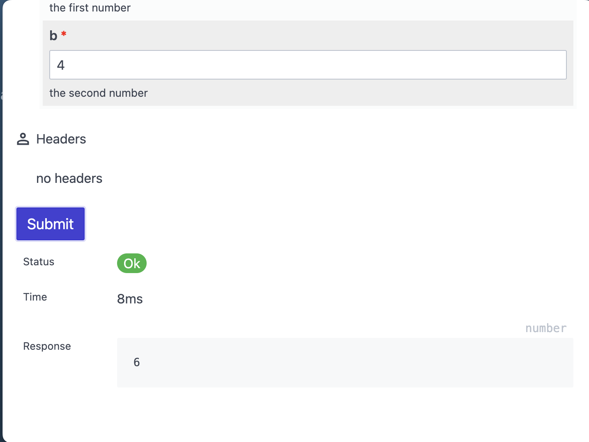

Agreeable UI
------------

A RPC explorer for [agreeable](https://github.com/agree-able/rpc) p2p rpc services. 

See [Agreeable RPC](https://github.com/agree-able/rpc) for creating p2p endpoints that you can test with this tool.

### Running

This tool is built with [Pear](https://github.com/holepunchto/pear).

```
git clone https://github.com/agree-able/ui
cd ui
npm i
pear run .
```

The first screen will ask you for a peer key to connect to.



On connection



Once it connects, you will see the api role, version and description. Then the routes available to call as functions. You can also download the agreement in .mjs or .json



You can expand a route to inspect it and see the parameters, types and prepare to call it




on submit you will see the result that was provided from the remote server.
